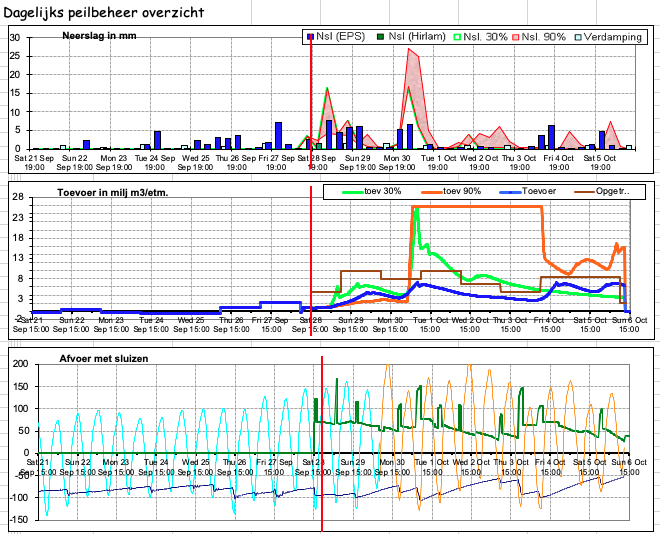
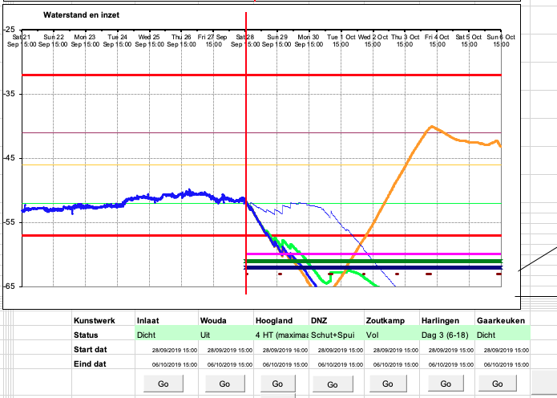
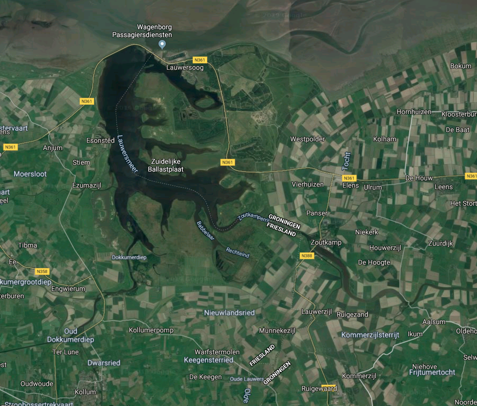
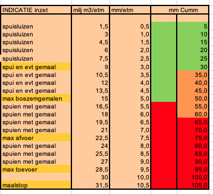

```{r setup, include=FALSE}
knitr::opts_chunk$set(echo = TRUE)
```

\section{Some details of hydrological model}

* The hydrological model is initialised every 6 hours with Harmonie and every 12 hours from ECMWF (EPS).
* To initialise the hydrological model three different rainfall forecasts are used. These include the high resolution model run (blue bars), the 90\% (orange) and 30\% (green) (?pointwise quantiles) from the raw ensemble. This results in three outputs from the hydrological model. 
* Storm surge initialisation is from the high resolution model run only.
* Average monthly evaportation rates are also included, these are relevent in Summer but less so in Winter (light blue bars)

{ width=80% }

\section{Polders}

From Wikipedia: 

\textit{A polder is a low-lying tract of land that forms an artificial hydrological entity, enclosed by embankments known as dikes. The three types of polder are:}

* \textit{Land reclaimed from a body of water, such as a lake or the sea bed}
* \textit{Flood plains separated from the sea or river by a dike}
* \textit{Marshes separated from the surrounding water by a dike and subsequently drained.}

\textit{The ground level in drained marshes subsides over time. All polders will eventually be below the surrounding water level some or all of the time. Water enters the low-lying polder through infiltration and water pressure of ground water, or rainfall, or transport of water by rivers and canals. This usually means that the polder has an excess of water, which is pumped out or drained by opening sluices at low tide.}

{ width=80% }

In Fryslân there are ~600 pumps that are used to move water from the polders to the canal belt system. The core output of the hydrological model is the estimated  discharge neede from the canal belt system, which includes the rainfall-runoff from the Polder system.

{ width = 80% }

\section{Lake Lauwersmeer and Harlingen}

Key to controlling the water height in the canal belt system is Lake Lauwersoog. Discharge from the polder system into the lake, via two sluices, and discharge from pump systems from Gronginen can increase the water level of the lake. The height of the water can also be changed by the direction of the wind. The normal height of the lake is -0.93 m NAM and in the belt canal is -0.52 m NAM. If the water level of the lake equals that of the canal belt, water from the polders can not be discharged into the lake. To discharge water from the lake into the sea the associated sea level must be 0.1 m lower. This prevents saline mixing in the lake. (Not clear if this can be relaxed in times of flood.) Ideally the difference is much greater for mass discharge suc has during a flood event.

Harlingen also plays a much smaller role in controlling levels in the belt canal system. Ideally Harlingen is opened everyday. As the sluice is only manned 16 hours, this can mean twice a day depending on when the low tide cycles fall. If the forecast requires it someone can stay during the night to open the sluice. The operation at Harlingen is considered to be directly impacted by tide whereas at Lake Lauwersoog, the impacts are indirect as the lake can be allowed to fill. 

{ width=80% }

\section{Risk level}

The water level in the canal belt system that needs to be avoided is -0.32 m. The sluice gates are Harlingen and Lake Lauwersoog are used to ensure this is the case. When the discharge from the polders is too high due to rainfall, sluices, electric pumps and steam pumps can be used to move the water from Lake Lauwersmeer. Ideally sluices can be used, however in the case of storm surge then electric pumps and steam pumps may be necessary. The table below shows the general rule of thumb for when sluices, electric pumps and steam pumps are needed. If in the 9 days prior there is less than 30 mm of rainfall sluices are generally sufficient, if less than 60 mm falls, electric pumps are required additionally, and if more than 60 mm than steam pumps may also be needed. These levels can be used to inform our event based approach to post-processing. Depending on where the rainfall occurs the resulting polder discharge can be very different, ie industrial areas compared to sand based regions. However, this is the general operating idea.

{ width=80% }

\section{Questions}

* Is the rainfall input into the hydrological model gridded or is it averaged across the province? 

* The Neerslag amounts plotted, are these aggregated across the province?

* Why are there two red lines on the plot for rainfall? I understood the top red line to be the ensemble member that corresponds to the 90 percentile. 

* Also how is the 90th percentile calculated? Is it at each time-step, or is this from the same member from the ensemble? And if it a member from the ensemble then is the the 90th percentile across the whole forecast period?

* Just to clarify the hydrological model is run three times using the inputs of the 30%, 90% and high resolution rainfall forecasts?

\section{Other comments:}

Kalss Jan Heeringen from Deltares is working with Siebe Bosch from Hydro Consulting to improve the hydrological model used by the waterboard. This will include simulations of 800 years of possible climate scenarios that can be used to estimate compound risk. Pier has put me in contact. I am hoping that I can make sure my insights I generate from post-processing with still be relevant under the new model.
